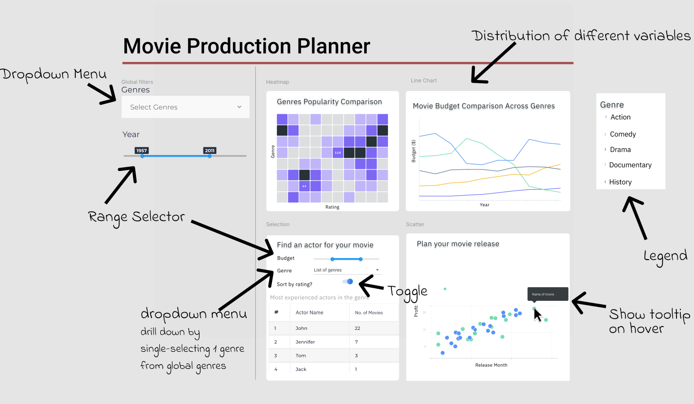

# Movie Production Planning Dashboard

## Link to the deployed app

https://moveymoney.herokuapp.com/

## Description of the app

This data visualization app aims at helping movie producers plan their next release (For more details please see the [proposal document](proposal.md)). The app contains a landing page with 4 key visualizations. A set of global filters located on the left hand menu control these visualizations. These include a dropdown menu allowing multi-selection of genres and a date range selector to narrow down results based on movie release date. The 4 key visualization allow the user to answer different questions. These are :-

### 1. Genre vs Rating (Heatmap)

The user would be able to see a heat map which depicts the ratings that movies belonging to a particular genre or category have received. This would help the user answer the question - Which genres tend to be well received by audiences? This would allow a movie producer to make a more informed decision on the kind of movie to produce.

### 2. Genre vs Budget (Line plot)

The user would see a line plot depicting how the average budget of a movie of a particular genre has changed over time. This would help provide insights to answer the question - "What is the average current cost to produce a movie of a particular genre?". Another question that can be answered is "Have movie budgets for a given genre gone up or down in recent years?" This can be an important consideration point for planning purposes.

### 3 Actor suggestions based on genre, movie budget and past ratings

This would help a user (such as a movie producer) find lead actors to star in their movie. The user can drill down on a genre that is selected globally, set their budget, and the app will show a list of actors with most experience in this genre based on the number of relevant movies they have starred in. The search results can be sorted by average ratings of the actors’ previous movies.

### 4. Release month vs profit made

This would help the user plan the release month for their movie. The user will be able to visualise the profit made by movies depending on which month they were released. The dashboard will display the profit made by movies grouped by their month of release. This could help the producer make a more informed choice on when to release their movie.

## App Sketch

